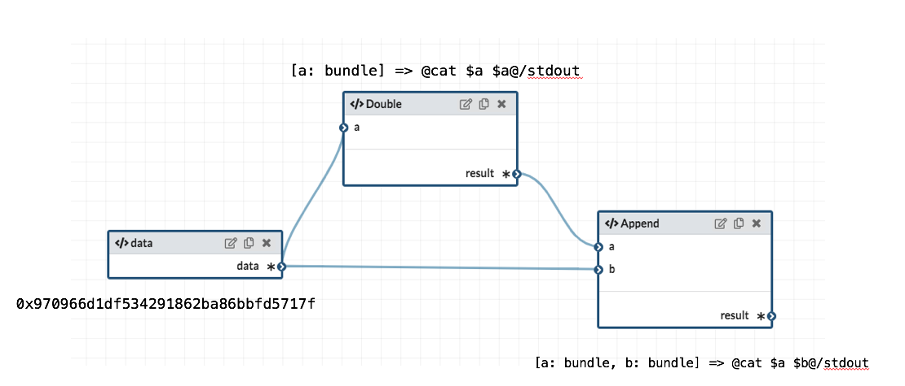
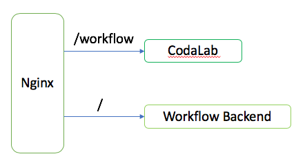
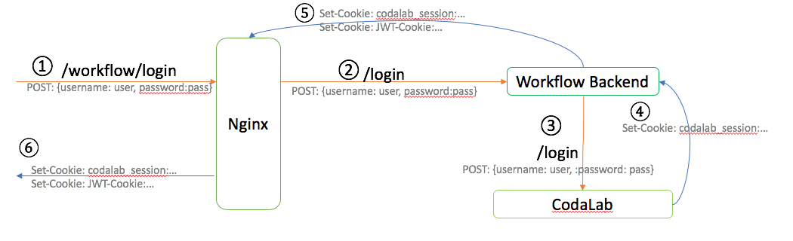

# Workflow - A graphical programming interface of [CodaLab](https://worksheets.codalab.org/)

Workflow is essentially [Galaxy](https://usegalaxy.org/)+[CodaLab](https://worksheets.codalab.org/), where you can create complex computation pipelines by editing a flowchart and submit the generated commands to a CodaLab instance. Checkout the [demo page](demo_link) for a complete overview.

## Tutorial
Visit the [demo page](demo_link) for a work through of the application.

## Why using Workflow


### Compared to Galaxy
[Galaxy](https://usegalaxy.org/) is a well-known data analysis platform in the bioinformatics community. The flowchart interface of Workflow is actually inspired by the Galaxy. The advantages of Workflow over Galaxy can be largely summarized in one word: CodaLab. Because of using CodaLab, computation results in Workflow can be easily shared and reproduced. In Workflow, users can define their own tools using arbitrary shell commands. While in galaxy, users can only use predefined tools managed by administrators. 

As will be mentioned [later](#how-it-works), Workflow is based on a typed programming language [CodaLang](https://github.com/jyh1/codalang). The flowchart in Workflow is actually a CodaLang expression. This means tools in Workflow can be composed and reused in a principled way. For example, in Workflow you can turn a complex flowchart in a function and use it as a single node when creating new pipelines. This is not possible in Galaxy.
 

### Compared to CodaLab
Workflow is built on top of [CodaLab](https://worksheets.codalab.org/). 
It provides two extensions to the regular CodaLab CLI interface: the ability to define functions and a visual programming interface to compose those functions in a flowchart to build a computation pipeline or a new function. Workflow is able to compile a built pipeline to a series of `cl run` commands and automatically submit them.


## How it works
The core functionality of Workflow is powered by [CodaLang](https://github.com/jyh1/codalang). Each node in the flowchart has an underlining CodaLang expression, which is called `node expression`. A graph that is created by connecting nodes together is essentially a representation of a bigger CodaLang expression composed from the underlining expressions in each node.

For example, suppose we have the following graph:


It is a simple pipeline where we replicate the content of a file three times. Each node is annotated with its node expression.

### Function Nodes
The `data` node is a `value node`, meaning its `node expression` is not a function and it doesn't have input ports. The `Double` and `Append` are `function node`s as their `node expression`s are functions. Their input ports correspond to the function arguments and the inward connections indicate where the argument values come from. In this example, the `Double` node only takes one argument from `data` node and the two arguments of the `Append` node come from `Double`  and `data`.

### Build Graph
Finally, the whole graph will be built into a large CodaLang expression itself. The basic strategy is to generate a `let` expression where we assign each `node expression` to the node name.
#### Eliminate Functions
As we have seen before, the `node expression` can be either a function or a regular value. In this step, we will transform the functions to values by filling their arguments.

In the above example, the `Double` node is a function node, it receive connection from `data` in the port `a`. We will therefore transform its `node expression` to `([a: bundle] => @cat $a $a@/stdout)[a: data]`. Basically apply `data` to the function. Similarly, the `node expression` in `Append` will become `([a: bundle, b: bundle] => @cat $a $b@/stdout)[a:Double, b: data]`.

#### Generate Expression
Since there is no function in `node expression` anymore, the last step is simply assigning them to their node names in topological order in a `let` expression. The above example will generate:
```shell
let
    data = 0x970966d1df534291862ba86bbfd5717f;
    Double = ([a: bundle] => @cat ${a} ${a}@/stdout)[a: data]; # apply data to the function
    Append = ([a: bundle, b: bundle] => @cat $a $b@/stdout)[a: Double, b: data]; # apply Double and data
in
    Append
```

The above process is a simplified version. In the real implementation, in order to deal with multiple outputs, the actual `node expression` is either a `record` or a function that returns a `record`. It slightly complicate the whole process but the basic idea is the same. 

#### Unfilled Input Ports
If there are unfilled input ports in the graph, Workflow will try to build the graph to a CodaLang function by treating those unfilled ports as arguments. You can also explicitly create argument nodes in the flowchart.

## Backend Setup
Workflow is based on CodaLab, it needs to constantly communicate with the CodaLab instance to fetch bundles/worksheets information and submit jobs to it. It also requires its own backend server to persistently save user-defined graphs and tools, compile [CodaLang](https://github.com/jyh1/codalang) code, serve static contents and so on. It can get complicate with authentication and CORS restriction when there are two servers. The current hack-ish way is:



The CodaLab and Workflow backend are brought together behind a same url by reverse proxy, so the frontend can communicate with both servers.

### Authentication
Authentication is a tricky process. As we have seen before, there are two separate servers at the backend: CodaLab and Workflow backend. In order to authenticate with the two servers at the same time, the current process looks like this:



In this setting, users can just use their CodaLab accounts for authentication. The frontend will first post the credential to the Workflow Backend (Step 1 and Step 2). The Workflow Backend will then try to authenticate with CodaLab with the credentials from the POST request (Step 3). If success, CodaLab server will return a cookie token called "codalab_session" (Step 4). The Workflow Backend will check the existence of this cookie and generate its own JWT cookie. It will reply both cookies to the frontend (Step 5 and 6). 

If the above process succeed, the frontend will get two cookies and can use them to directly communicate with both servers.

## Start your own instance
You can easily set up everything with a simple `docker-compose` command. Check out the [Docker repository](https://github.com/jyh1/codalabworkflow-docker) for Workflow.

## Build from source

### Frontend
```
yarn install
npx webpack
mkdir -p build
cp -r dist build
cp index.production.html build/index.html
```

### Backend
Please refer to the [backend repository](https://github.com/jyh1/codalang-server).